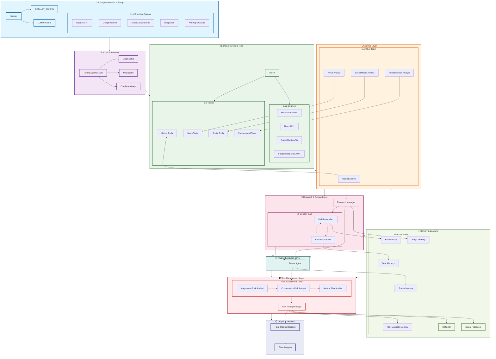
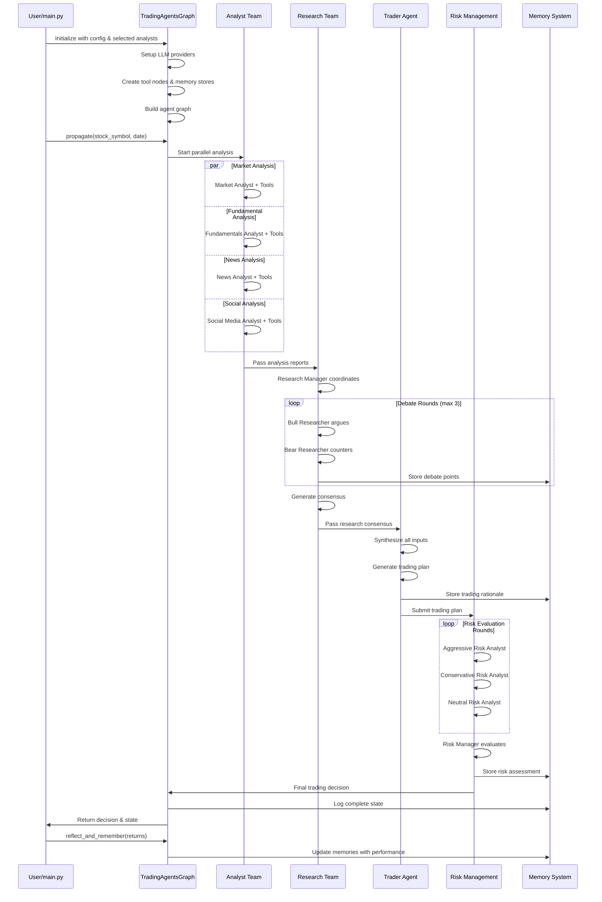
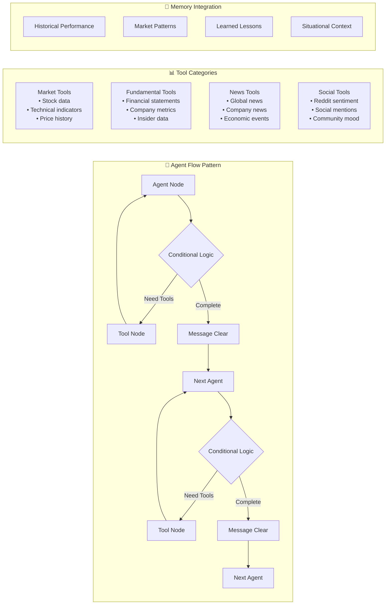

# TradingAgents Framework Architecture

## Complete Solution Architecture



## Detailed Component Flow



## Agent Interaction Pattern



## Configuration & Model Management

```mermaid
graph TD
    subgraph "⚙️ Model Configuration Flow"
        USER_CONFIG[User Configuration] --> LLM_SELECTION{LLM Provider Selection}
        
        LLM_SELECTION -->|openai| OPENAI_SETUP[OpenAI Setup<br/>• GPT-4o-mini (quick)<br/>• o4-mini (deep)]
        LLM_SELECTION -->|google| GOOGLE_SETUP[Google Setup<br/>• Gemini models<br/>• API key config]
        LLM_SELECTION -->|dashscope| ALIBABA_SETUP[Alibaba DashScope<br/>• Qwen models<br/>• Chinese optimization]
        LLM_SELECTION -->|deepseek| DEEPSEEK_SETUP[DeepSeek Setup<br/>• V3 models<br/>• Token tracking]
        LLM_SELECTION -->|anthropic| CLAUDE_SETUP[Anthropic Setup<br/>• Claude models<br/>• Constitutional AI]
        
        OPENAI_SETUP --> MODEL_INIT[Model Initialization]
        GOOGLE_SETUP --> MODEL_INIT
        ALIBABA_SETUP --> MODEL_INIT
        DEEPSEEK_SETUP --> MODEL_INIT
        CLAUDE_SETUP --> MODEL_INIT
        
        MODEL_INIT --> AGENT_ASSIGNMENT[Agent Assignment<br/>• Deep thinking LLM<br/>• Quick thinking LLM]
    end

    subgraph "🎯 Model Usage Strategy"
        DEEP_TASKS[Deep Thinking Tasks<br/>• Research management<br/>• Risk evaluation<br/>• Final decisions]
        QUICK_TASKS[Quick Thinking Tasks<br/>• Data analysis<br/>• Tool calls<br/>• Intermediate steps]
        
        AGENT_ASSIGNMENT --> DEEP_TASKS
        AGENT_ASSIGNMENT --> QUICK_TASKS
    end
```

## Key Configuration Points for Language Model Changes

### 1. **Primary Configuration (main.py)**
```python
config["llm_provider"] = "your_provider"     # Provider selection
config["deep_think_llm"] = "model_name"      # Complex reasoning
config["quick_think_llm"] = "model_name"     # Fast operations
config["backend_url"] = "api_endpoint"       # API endpoint
```

### 2. **Supported Providers & Models**
- **OpenAI**: GPT-4o, GPT-4o-mini, o1-preview, o4-mini
- **Google**: Gemini-2.0-flash, Gemini-pro
- **Alibaba DashScope**: Qwen-plus, Qwen-turbo, Qwen-max
- **DeepSeek**: DeepSeek-V3, DeepSeek-chat
- **Anthropic**: Claude-3.5-sonnet, Claude-3-haiku

### 3. **Model Assignment Strategy**
- **Deep Thinking LLM**: Used for Research Manager, Risk Manager, final decisions
- **Quick Thinking LLM**: Used for Analysts, Researchers, Trader, tool operations

### 4. **Key Customization Points**
- **Agent Selection**: Choose which analysts to include
- **Debate Rounds**: Control discussion depth
- **Tool Configuration**: Online vs offline data sources
- **Memory Integration**: Enable/disable learning
- **Risk Tolerance**: Adjust risk assessment parameters
